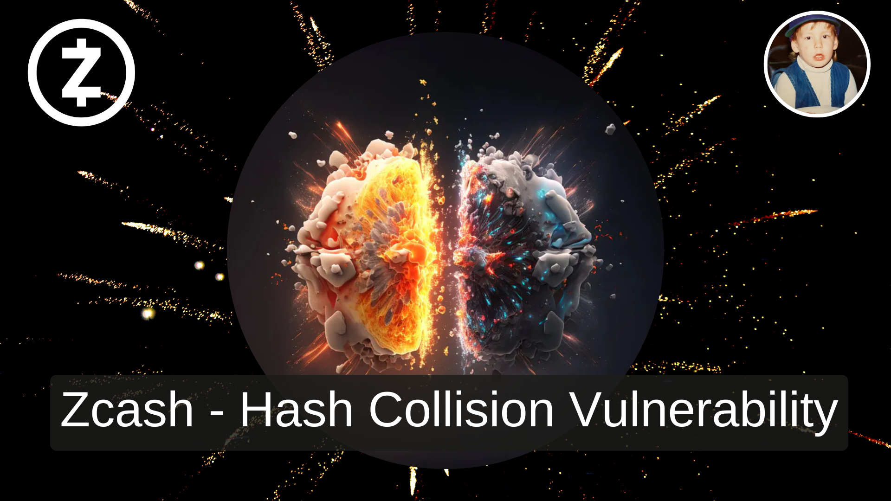
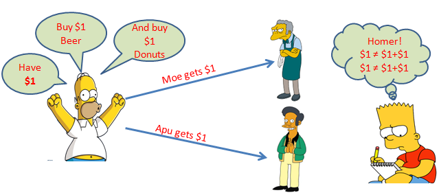
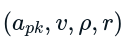
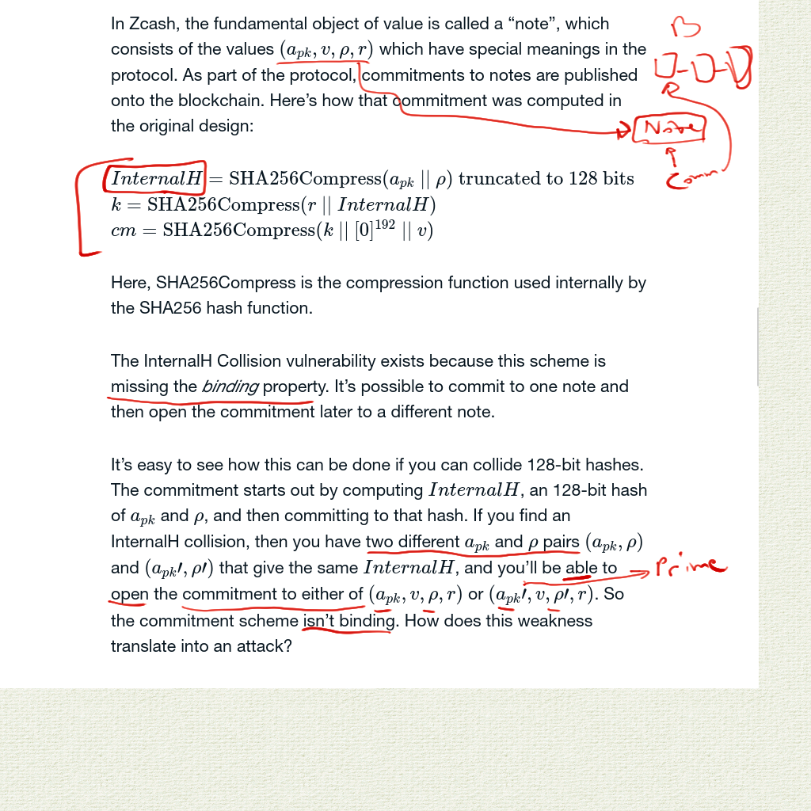
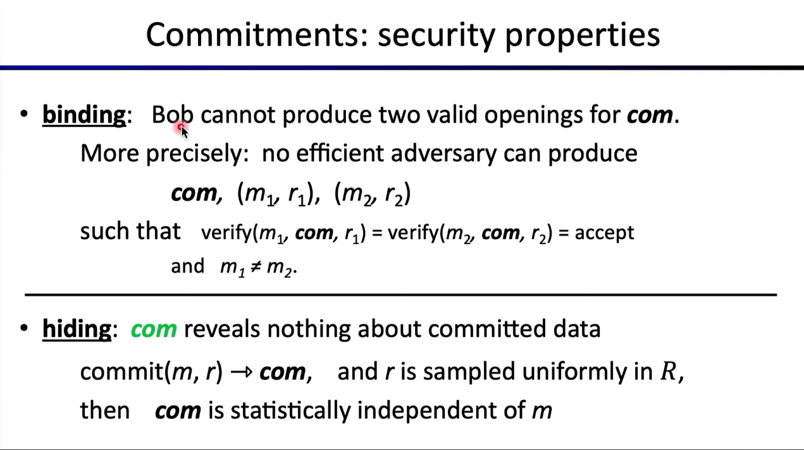
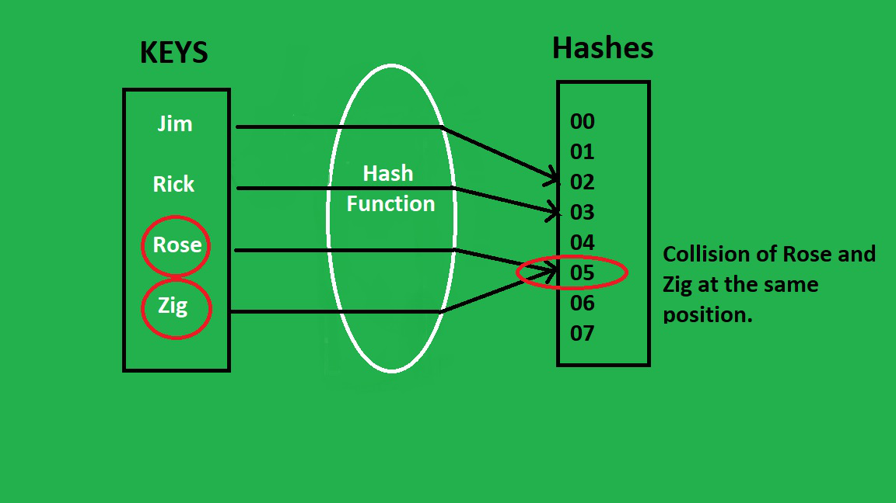

Sources:
- [Blog post](https://electriccoin.co/blog/fixing-zcash-vulns/?utm_source=pocket_reader) explaining the vuln and fix
- [Github](https://github.com/zcash/zcash/issues/738) thread discussion 
---
---
##### The Impact

==Double spending==, while creating money out of thin air

> Someone with enough computing power to find 128-bit hash collisions would have been able to double-spend money to themselves, creating Zcash out of thin air.

> For every 128-bit hash collision the attacker finds, they can ==effectively double their wealth by combining all of their Zcash into one double-spendable note and then double-spending it to themselves==. So even though the operations to find a collision aren’t cheap, the attack quickly pays off.

[Source](https://www.linkedin.com/pulse/blockchain-double-spending-problem-harinder-seera/)

---
##### The Mistake

Note/Coin (base object in Zcash) contains (Apk,v,ρ,r)

- A*pk* - Address ==public key== - Published publicly enabling others to direct payments to the user (similar to inboxes via emails)
- v - the corresponding ==amount== of the note (i.e. value)
- ρ - is a ==secret value== that determines the coin’s serial number 
	- *serial number = a unique string associated with the coin, which used to prevent double spending* (similar to a UUID)
	- [Nullifier](https://zcash.github.io/orchard/design/nullifiers.html) is likely the new term for "serial number" in Zcash
> 		*- we set ρ to be the nullifier of the spent note*
- r - used (within CRH(sn‖r)) to compute the ==random number== of the note commitment (~I think~)

---
##### Security Properties from Commitment Schemes 

- Binding and Hiding are two key pieces for the security of a commitment scheme. ==Binding== in this case has ==failed==. 
	- Dan Boneh does a great job in this course explaining the purpose and function of binding/hiding [within this lecture](https://youtu.be/H3GmsxRU1Kw?t=832). (highly recommended lecture)

Below is a simple example of the binding and hiding properties through a [Bulletproof](https://youtu.be/ilGfKH-kFiQ) (kind of range proof) - [Image source](https://medium.com/coinmonks/zero-knowledge-proofs-um-what-a092f0ee9f28)

Formal explanation from Dan's lecture above

---
##### 128-bit hash collision (similar to[ MD5](https://en.wikipedia.org/wiki/MD5#Collision_vulnerabilities))

[Source](https://www.geeksforgeeks.org/java-program-to-implement-hash-tables-chaining-with-doubly-linked-lists/)

The time it'll take depends on the computation the attacker has, but from [one reference](http://people.scs.carleton.ca/~paulv/papers/JoC97.pdf) within the blog post we can see... 

>  To illustrate the use of ==parallel== collision search for practical cryptanalytic problems, designs were given for ==three $10 million== custom machines which could be built with current technology: one finds elliptic curve logarithms in GF(2^155) thereby defeating a proposed elliptic curve cryptosystem in expected time 32 days; the second finds ==MD5 collisions in expected time 21 days==;

*Note: It would've taken three $10 million computers, running for 21 days to achieve the above exploit on Zcash.* 

Here's an intuitive explanation to what "hash collisions" are [by Computerphile](https://youtu.be/b4b8ktEV4Bg?t=97). 

---
##### The Fix

Swap out the commitment scheme that has ==secure binding==

Make a trade off between statistically "perfect" hiding and computationally strong hiding. 

> In order to keep the Zcash zero-knowledge proofs efficient to compute, we dropped the powerful statistical hiding property and settled for the regular one.

> cm=SHA256(0xB0 || apk || v || ρ || r)> 
- Updated to SHA256, with "0xB0" included

More details
> [InternalH](http://zerocash-project.org/media/pdf/zerocash-extended-20140518.pdf) was chosen to be 128 bits in order to give the commitment scheme a very strong property called _statistical hiding_. The ordinary hiding property is ==computational==: it says that you can’t learn anything about the input unless you have an ==absurdly fast computer== (i.e. capable of breaking SHA256). ==Statistical== hiding says that _even if you have an ==infinitely fast computer_==, you still can’t learn anything about the input. This would have allowed Zcash to retain its privacy guarantees even if one day the SHA256 hash function were broken.
